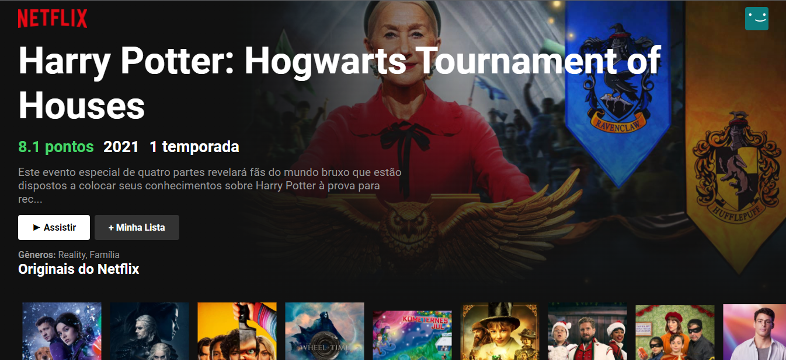
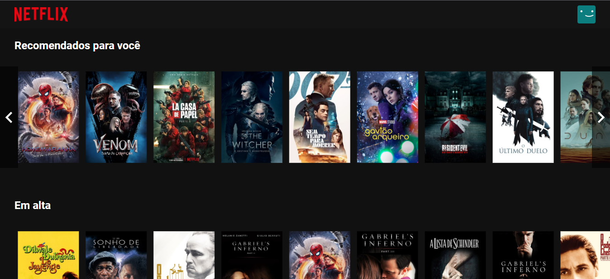
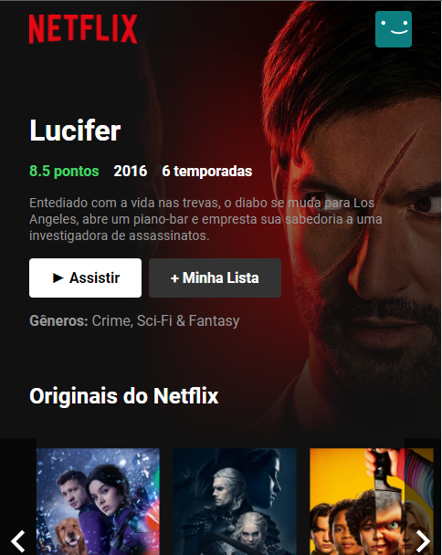

<h1 align="center"> ReactFlix 📽 </h1>

## Informações 📖

- Esse pequeno projeto foi desenvolvido com o intuito de praticar ReactJS.

- Trata-se de um clone da Netflix.

- Você vai encontrar apenas a página com filmes e séries.

<br>

## Como rodar ❓

```bash

git clone https://github.com/d3vnicolas/reactFlix.git

cd reactFlix

npm install

npm start

```
⚠️ <strong>É necessário uma conexão com a internet para carregar os dados da API TMDB.</strong> ⚠️

<hr>
<br>

## Screenshots do projeto 📸

<br>

<p align="center">

</p>
<p align="center">

</p>
<p align="center">

</p>

<br>
<br>
<br>

## Tecnologias utilizadas 🚀

<br>
<br>

<p align="center">
    
</p>

<br>
<br>

<p align="center">
    
</p>

<br>
<br>
<br>

##  Contribua comigo 🤗

<br>

- Faça um fork desse repositório.
- Marque com star.
- Entre em contato para dúvidas ou sugestões.

<br>
<br>

##  Desenvolvedor 👨🏽‍💻

<table align="center">
    <tr>
        <td align="center">
            <a href="https://github.com/d3vnicolas">
                
            </a>
        </td>    
    </tr>
</table>
<h3 align="center">
   Feito com ❤️ por:  <a href="https://www.linkedin.com/in/nicolas-soares-887655220/" target="_blank"> Nicolas Soares </a>
</h3>


